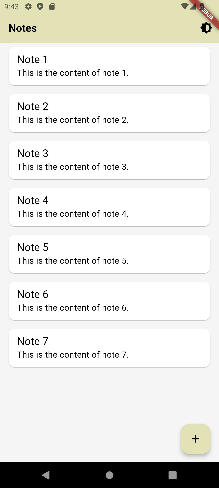
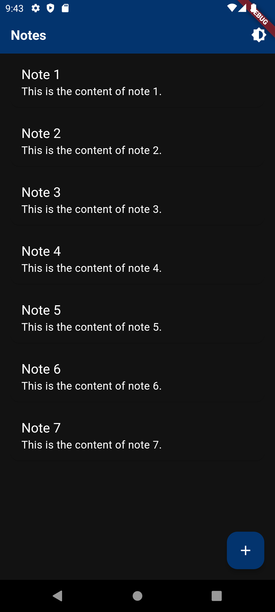

# NoteAppXYZ

A Flutter project for managing notes.

## Getting Started

This project is a starting point for a Flutter application.

A few resources to get you started if this is your first Flutter project:

- [Lab: Write your first Flutter app](https://docs.flutter.dev/get-started/codelab)
- [Cookbook: Useful Flutter samples](https://docs.flutter.dev/cookbook)

For help getting started with Flutter development, view the
[online documentation](https://docs.flutter.dev/), which offers tutorials,
samples, guidance on mobile development, and a full API reference.

## Features

- [x] Add notes
- [x] View notes
- [ ] Manage notes
- [x] Light and dark theme support

## Screenshots

<table>
  <tr>
    <td></td>
    <td></td>
  </tr>
</table>

## Installation

1. Clone the repository:
    ```sh
    git clone https://github.com/abdelillahbel/noteappxyz.git
    ```
2. Navigate to the project directory:
    ```sh
    cd noteappxyz
    ```
3. Install dependencies:
    ```sh
    flutter pub get
    ```
4. Run the app:
    ```sh
    flutter run
    ```

## Contributing

Contributions are welcome! Please open an issue or submit a pull request for any changes.

## License

This project is licensed under the MIT License.